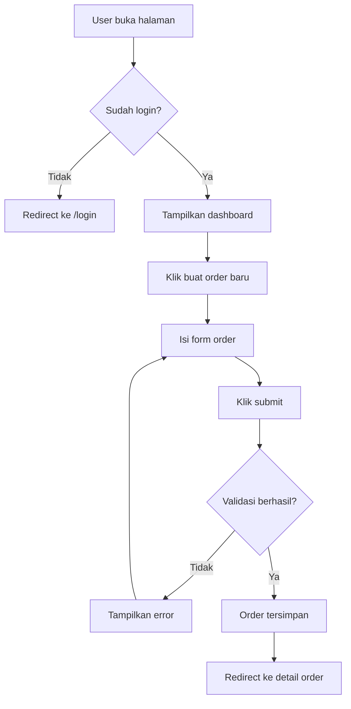
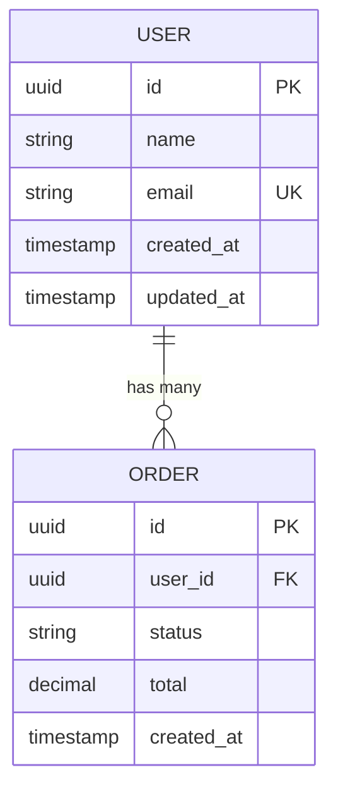

# Dokumentasi Pengembangan Produk

Direktori `docs/` berisi seluruh dokumentasi perencanaan dan pengembangan produk. Dokumentasi dibuat secara **bertahap** mengikuti alur kerja dua jalur:

```
                    ┌── UX Flow ── UI Spec ──────┐
         PRD ──────┤                              ├──→ Implementasi
                    └── ERD ────── API Contract ──┘
```

- **Jalur Frontend**: PRD → UX Flow → UI Spec
- **Jalur Backend**: PRD → ERD → API Contract

Kedua jalur bisa dikerjakan **paralel** karena sumber kebenarannya sama: **PRD**.

---

## Struktur Direktori

```
docs/
├── README.md                       # ← Kamu di sini
├── <nama-fitur>/
│   ├── prd.md                      # 1. Product Requirements Document
│   ├── ux-flow.md                  # 2a. User Flow & Sitemap
│   ├── ui-spec.md                  # 2b. UI Specification
│   ├── erd.md                      # 3a. Entity Relationship Diagram
│   └── api-contract.md             # 3b. API Contract (RESTful)
└── <nama-fitur-lain>/
    └── ...
```

Setiap fitur/modul memiliki folder sendiri di bawah `docs/`.

---

## Alur Pembuatan Dokumentasi

### 1️⃣ PRD (Product Requirements Document)

> **Dibuat pertama kali.** PRD adalah single source of truth untuk scope fitur.

#### Cara Membuat PRD

Gunakan prompt berikut untuk men-generate PRD dari ide produk:

```
I have an idea for building a webapp/saas/etc. I need you to help me to create
the PRD for the idea. So the idea is:

" {masukkan ide produk di sini} "

And then draft me these:
- Product Overview
- Background Problem & Solution
- Features (Core, NTH (Nice to Have), PTH (Plan to Have))
- User Stories (role, action, goal)
- Reference
```

#### Struktur PRD

```markdown
# PRD: [Nama Fitur]

## Product Overview
Deskripsi singkat tentang produk/fitur yang akan dibangun.

## Background Problem & Solution
### Problem
Masalah apa yang dialami user saat ini.

### Solution
Bagaimana fitur ini menyelesaikan masalah tersebut.

## Features

### Core Features
Fitur utama yang **harus ada** di versi pertama (MVP).
- [ ] Fitur A
- [ ] Fitur B

### Nice to Have (NTH)
Fitur tambahan yang bagus jika ada, tapi tidak blocking untuk launch.
- [ ] Fitur C

### Plan to Have (PTH)
Fitur yang direncanakan untuk versi berikutnya.
- [ ] Fitur D

## User Stories
- Sebagai [role], saya ingin [action], agar [benefit].
- Sebagai [role], saya ingin [action], agar [benefit].

## Reference
Link referensi, kompetitor, inspirasi desain, dll.
```

---

## Jalur Frontend

### 2a️⃣ UX Flow

> **Di-generate dari PRD.** Fokus pada *bagaimana user menyelesaikan task*, bukan tampilan.

#### Aturan

- Harus traceable ke user stories dan features di PRD
- Gunakan Mermaid flowchart untuk diagram user flow
- Definisikan state halaman: empty, loading, error, success

#### Cara Generate

Berikan PRD sebagai konteks, lalu gunakan prompt:

```
Berdasarkan PRD berikut, buatkan UX Flow yang berisi:
- Sitemap (peta halaman dan hierarki)
- User flow diagram untuk setiap core feature (Mermaid flowchart)
- Navigation pattern (sidebar/tabs/breadcrumb/dll)
- State & edge cases per halaman (empty, loading, error, success)

PRD:
{paste isi prd.md}
```

#### Struktur UX Flow

````markdown
# UX Flow: [Nama Fitur]

> Berdasarkan: [link ke prd.md]

## Sitemap

```
/                           → Landing / Dashboard
├── /auth
│   ├── /login              → Halaman login
│   └── /register           → Halaman register
├── /dashboard              → Dashboard utama
├── /orders
│   ├── /                   → Daftar order
│   ├── /new                → Buat order baru
│   └── /:id                → Detail order
└── /settings               → Pengaturan akun
```

## Navigation Pattern

- **Layout utama**: Sidebar (desktop) + Bottom nav (mobile)
- **Navigasi sekunder**: Breadcrumb di halaman detail
- **Auth guard**: Redirect ke `/login` jika belum login

## User Flows

### Flow: [Nama Core Feature]



### Flow: [Nama Core Feature Lain]
...

## State per Halaman

### /orders (Daftar Order)
| State   | Tampilan                                          |
|---------|---------------------------------------------------|
| Loading | Skeleton placeholder                              |
| Empty   | Ilustrasi + teks "Belum ada order" + tombol CTA   |
| Error   | Alert banner + tombol retry                       |
| Success | Tabel data + pagination                           |

### /orders/new (Buat Order)
| State   | Tampilan                                          |
|---------|---------------------------------------------------|
| Default | Form kosong                                       |
| Loading | Tombol submit disabled + spinner                  |
| Error   | Inline error di field yang salah                  |
| Success | Toast "Order berhasil dibuat" + redirect           |
````

---

### 2b️⃣ UI Spec

> **Di-generate dari UX Flow.** Fokus pada *tampilan konkret*: layout, komponen, dan interaksi detail.

#### Aturan

- Harus mengacu pada halaman dan flow yang sudah didefinisikan di UX Flow
- Mapping ke komponen **shadcn/ui** yang tersedia
- Sertakan responsive behavior (desktop vs mobile)

#### Cara Generate

Berikan UX Flow sebagai konteks, lalu gunakan prompt:

```
Berdasarkan UX Flow berikut, buatkan UI Spec yang berisi:
- Layout per halaman (struktur grid, posisi komponen)
- Komponen shadcn/ui yang digunakan per halaman
- Interaksi detail (apa yang terjadi saat klik, hover, submit)
- Responsive behavior (desktop vs mobile)

Kita menggunakan: React, TanStack Router (file-based routing), shadcn/ui,
Tailwind CSS v4, lucide-react icons.

UX Flow:
{paste isi ux-flow.md}
```

#### Struktur UI Spec

````markdown
# UI Spec: [Nama Fitur]

> Berdasarkan: [link ke ux-flow.md]

## Layout Global

- **Desktop**: Sidebar 280px (kiri) + Content area (kanan)
- **Mobile**: Bottom navigation + hamburger menu
- **Header**: Logo + user avatar + dropdown menu

## Halaman: /orders

### Layout
```
┌──────────────────────────────────────────┐
│  Header: "Daftar Order"    [+ Buat Baru] │
├──────────────────────────────────────────┤
│  Search input          Filter dropdown   │
├──────────────────────────────────────────┤
│  Table                                   │
│  ┌──────┬────────┬────────┬──────────┐   │
│  │ ID   │ Nama   │ Status │ Aksi     │   │
│  ├──────┼────────┼────────┼──────────┤   │
│  │ #001 │ Order A│ ●Active│ [Detail] │   │
│  │ #002 │ Order B│ ●Draft │ [Detail] │   │
│  └──────┴────────┴────────┴──────────┘   │
├──────────────────────────────────────────┤
│  Pagination: < 1 2 3 ... 10 >            │
└──────────────────────────────────────────┘
```

### Komponen
| Komponen        | shadcn/ui          | Keterangan                    |
|-----------------|--------------------|-------------------------------|
| Header          | —                  | Custom, flexbox               |
| Tombol Buat     | `Button`           | variant="default", size="sm"  |
| Search          | `Input`            | placeholder="Cari order..."   |
| Filter          | `Select`           | options: Semua, Active, Draft |
| Tabel           | `Table`            | Sortable columns              |
| Status badge    | `Badge`            | variant sesuai status         |
| Pagination      | `Pagination`       | —                             |

### Interaksi
- **Klik "Buat Baru"** → Navigate ke `/orders/new`
- **Klik row tabel** → Navigate ke `/orders/:id`
- **Ketik di search** → Debounce 300ms, filter tabel
- **Ganti filter** → Reset ke halaman 1, re-fetch data

### Responsive
- **Desktop**: Tabel penuh dengan semua kolom
- **Mobile**: Kolom ID hidden, aksi jadi icon button
````

---

## Jalur Backend

### 3a️⃣ ERD (Entity Relationship Diagram)

> **Di-generate dari PRD.** ERD dibuat berdasarkan fitur-fitur yang didefinisikan di PRD.

#### Aturan

- Setiap entitas harus bisa di-trace balik ke fitur tertentu di PRD
- Gunakan format Mermaid untuk diagram
- Sertakan daftar tabel beserta field, tipe data, dan relasi

#### Cara Generate

Berikan PRD sebagai konteks, lalu gunakan prompt:

```
Berdasarkan PRD berikut, buatkan ERD yang berisi:
- Mermaid ER diagram
- Deskripsi setiap entitas (field, tipe, constraint)
- Penjelasan relasi antar entitas

PRD:
{paste isi prd.md}
```

#### Struktur ERD

````markdown
# ERD: [Nama Fitur]

> Berdasarkan: [link ke prd.md]

## Diagram



## Deskripsi Entitas

### User
| Field      | Type      | Constraint  | Keterangan        |
|------------|-----------|-------------|-------------------|
| id         | UUID      | PK          | Primary key       |
| name       | String    | NOT NULL    | Nama user         |
| email      | String    | UNIQUE      | Email login       |
| created_at | Timestamp | DEFAULT NOW | Waktu dibuat      |
| updated_at | Timestamp |             | Waktu diupdate    |

### Order
| Field      | Type      | Constraint  | Keterangan        |
|------------|-----------|-------------|-------------------|
| id         | UUID      | PK          | Primary key       |
| user_id    | UUID      | FK → User   | Relasi ke user    |
| status     | String    | NOT NULL    | DRAFT/ACTIVE/DONE |
| total      | Decimal   | NOT NULL    | Total harga       |
| created_at | Timestamp | DEFAULT NOW | Waktu dibuat      |
````

---

### 3b️⃣ API Contract

> **Di-generate dari ERD.** API mengikuti standar **RESTful HTTP**.

#### Aturan

- Endpoint mengikuti konvensi REST: `GET`, `POST`, `PUT/PATCH`, `DELETE`
- URL menggunakan **kebab-case** dan **plural nouns**: `/api/v1/users`, `/api/v1/orders`
- Response menggunakan format JSON yang konsisten
- Request body divalidasi dengan Zod (sesuai tech stack)

#### Cara Generate

Berikan ERD sebagai konteks, lalu gunakan prompt:

```
Berdasarkan ERD berikut, buatkan API Contract RESTful yang berisi:
- Daftar endpoint per entitas (CRUD)
- Request parameters, body, dan response untuk setiap endpoint
- HTTP status codes
- Konsisten menggunakan format response standar

ERD:
{paste isi erd.md}
```

#### Struktur API Contract

````markdown
# API Contract: [Nama Fitur]

> Berdasarkan: [link ke erd.md]

## Base URL

```
/api/v1
```

## Endpoints

### Orders

#### List Orders
```
GET /api/v1/orders
```

Query Parameters:
| Param  | Type   | Required | Keterangan           |
|--------|--------|----------|----------------------|
| page   | number | no       | Halaman (default 1)  |
| limit  | number | no       | Per page (default 10)|
| status | string | no       | Filter by status     |

Response `200 OK`:
```json
{
  "data": [
    {
      "id": "uuid",
      "userId": "uuid",
      "status": "ACTIVE",
      "total": 150000,
      "createdAt": "2026-01-01T00:00:00Z"
    }
  ],
  "meta": {
    "page": 1,
    "limit": 10,
    "total": 50
  }
}
```

#### Create Order
```
POST /api/v1/orders
```

Request Body:
```json
{
  "items": [
    { "productId": "uuid", "quantity": 2 }
  ]
}
```

Response `201 Created`:
```json
{
  "data": {
    "id": "uuid",
    "status": "DRAFT",
    "total": 150000,
    "createdAt": "2026-01-01T00:00:00Z"
  }
}
```

## HTTP Status Codes

| Code | Keterangan                           |
|------|--------------------------------------|
| 200  | OK — Request berhasil                |
| 201  | Created — Resource berhasil dibuat   |
| 400  | Bad Request — Validasi gagal         |
| 401  | Unauthorized — Belum login           |
| 403  | Forbidden — Tidak punya akses        |
| 404  | Not Found — Resource tidak ditemukan |
| 409  | Conflict — Data sudah ada            |
| 500  | Internal Server Error                |

## Response Format

```json
// Success (single)
{ "data": { ... } }

// Success (list)
{ "data": [ ... ], "meta": { "page": 1, "limit": 10, "total": 50 } }

// Error
{ "error": "Pesan error yang jelas" }
```
````

---

## Workflow Summary

```
┌─────────────────────────────────────────────────────────────────┐
│                                                                 │
│  1. IDE / KONSEP                                                │
│     Tulis ide produk/fitur                                      │
│                        ↓                                        │
│  2. PRD (prd.md)                                                │
│     Generate menggunakan prompt template                        │
│     Output: overview, problem, features, user stories           │
│                        ↓                                        │
│          ┌─────────────┴─────────────┐                          │
│          ↓                           ↓                          │
│  JALUR FRONTEND                JALUR BACKEND                    │
│                                                                 │
│  3a. UX FLOW (ux-flow.md)      3b. ERD (erd.md)                │
│      Input: PRD                    Input: PRD                   │
│      Output: sitemap,              Output: entitas,             │
│      user flow, states             relasi, diagram              │
│          ↓                           ↓                          │
│  4a. UI SPEC (ui-spec.md)      4b. API CONTRACT                 │
│      Input: UX Flow                (api-contract.md)            │
│      Output: layout,              Input: ERD                    │
│      komponen, interaksi           Output: endpoints,           │
│                                    request/response             │
│          ↓                           ↓                          │
│          └─────────────┬─────────────┘                          │
│                        ↓                                        │
│  5. IMPLEMENTASI                                                │
│     Mulai coding berdasarkan dokumentasi yang sudah ada         │
│                                                                 │
└─────────────────────────────────────────────────────────────────┘
```

---

## Tips

- **PRD dulu, baru yang lain.** Jangan langsung bikin ERD atau UI tanpa PRD. PRD adalah single source of truth untuk scope fitur.
- **Dua jalur bisa paralel.** UX Flow dan ERD bisa dikerjakan bersamaan karena keduanya bersumber dari PRD.
- **Satu folder per fitur.** Jangan campur dokumentasi fitur yang berbeda dalam satu file.
- **Gunakan checklist di PRD.** Tandai fitur yang sudah selesai diimplementasi dengan `[x]`.
- **Semua dokumen bisa di-generate.** Cukup berikan dokumen sebelumnya sebagai konteks ke prompt.
- **Iterasi.** Dokumentasi bukan batu — update seiring perkembangan fitur.

---

## Quick Reference: Urutan Generate

| # | Dokumen         | Input            | Prompt Keyword                                   |
|---|-----------------|------------------|--------------------------------------------------|
| 1 | `prd.md`        | Ide produk       | "Create PRD: overview, problem, features, stories"|
| 2a| `ux-flow.md`    | `prd.md`         | "Buatkan UX Flow: sitemap, user flow, states"    |
| 2b| `ui-spec.md`    | `ux-flow.md`     | "Buatkan UI Spec: layout, komponen, interaksi"   |
| 3a| `erd.md`        | `prd.md`         | "Buatkan ERD: entitas, relasi, diagram Mermaid"  |
| 3b| `api-contract.md`| `erd.md`        | "Buatkan API Contract: CRUD endpoints, response" |
