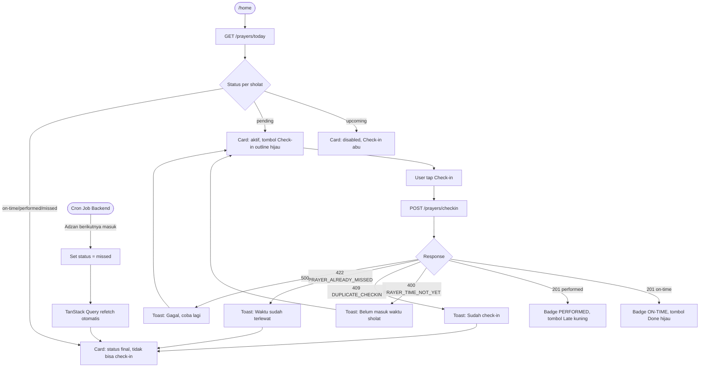
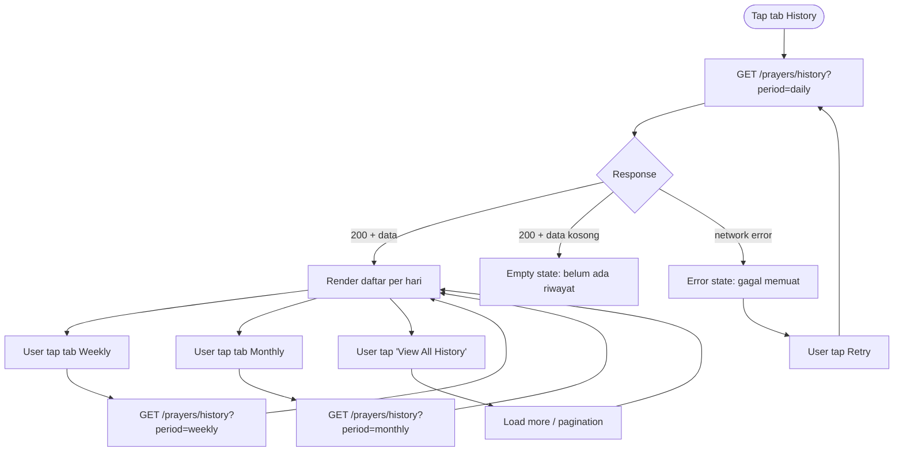
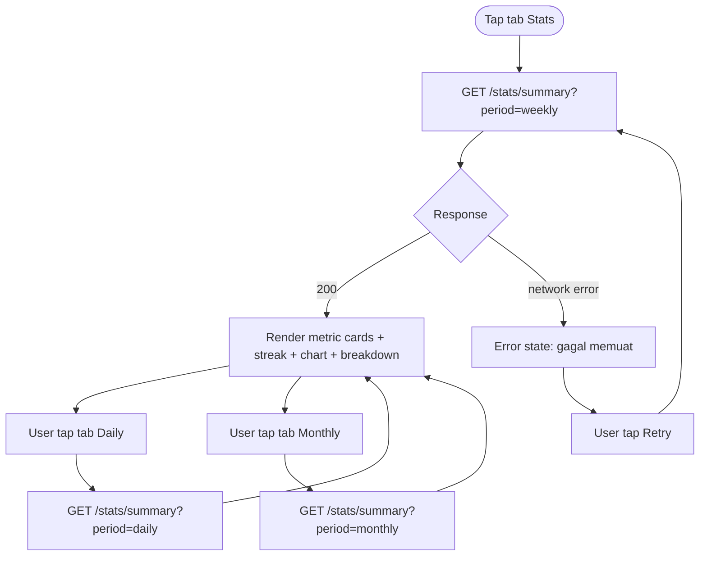
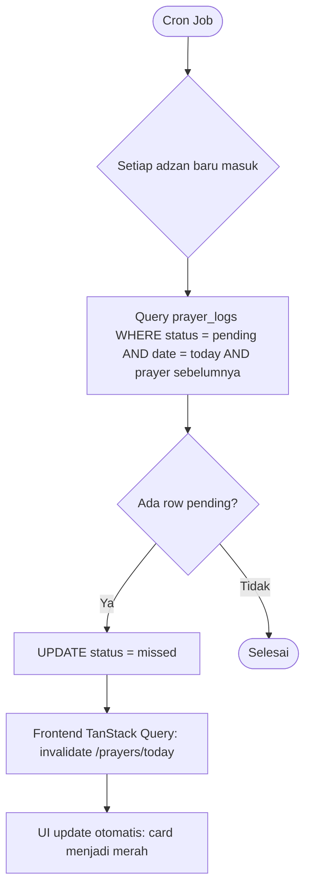

# UX Flow — Sholat Tracker
**Versi:** 1.0 | 17 Maret 2026  
**Berdasarkan:** PRD v1.0, API Contract v2.1, ERD v2.1, Issues (#1–#8)

---

## 1. Sitemap

```
sholat-tracker/
│
├── /auth
│   ├── /register          ← Default untuk user baru
│   └── /login
│
└── /app                   ← Protected (requires auth)
    ├── /home              ← Default setelah login (tab aktif: Home)
    ├── /history           ← Tab: History
    │   └── ?period=daily|weekly|monthly
    ├── /stats             ← Tab: Stats
    │   └── ?period=daily|weekly|monthly
    └── /settings          ← Tab: Settings
        └── /settings/calculation-method  ← Sub-halaman (modal/stack)
```

**Hierarki navigasi:**
- Level 0: Auth (tidak ada nav)
- Level 1: 4 tab utama (`/home`, `/history`, `/stats`, `/settings`) — persisten via Bottom Navigation Bar
- Level 2: Sub-halaman `/settings/calculation-method` — navigasi stack (back button)

---

## 2. User Flow Diagrams

### 2.1 Flow: Registrasi & Login

```mermaid
flowchart TD
    A([Buka App]) --> B{Token valid?}
    B -- Ya --> H([/home])
    B -- Tidak --> C[/auth/register]

    C --> D[Isi form: full_name, email, password]
    D --> E{Validasi client-side}
    E -- Gagal --> D
    E -- Lulus --> F[POST /auth/register]
    F --> G{Response}
    G -- 201 Created --> H
    G -- 409 Email exists --> D2[Tampil error: email sudah terdaftar]
    D2 --> D
    G -- 500 --> ERR1[Tampil toast error server]
    ERR1 --> D

    C --> L[Tap 'Sign In']
    L --> LF[/auth/login]
    LF --> LI[Isi email + password]
    LI --> LP[POST /auth/login]
    LP --> LR{Response}
    LR -- 200 OK --> H
    LR -- 401 Invalid credentials --> LE[Tampil error: email/password salah]
    LE --> LI

    C --> SSO1[Tap Google / Apple]
    SSO1 --> SSO2[OAuth flow eksternal]
    SSO2 --> H
```

---

### 2.2 Flow: Check-in Sholat (Core Feature)



---

### 2.3 Flow: History



---

### 2.4 Flow: Statistics



---

### 2.5 Flow: Settings

```mermaid
flowchart TD
    A([Tap tab Settings]) --> B[GET /settings]
    B --> C{Response}
    C -- 200 --> D[Render form dengan nilai saat ini]
    C -- error --> E[Error state]

    D --> F[User geser slider buffer]
    F --> G[Debounce 500ms]
    G --> H[PATCH /settings: global_buffer_minutes]
    H --> I{Response}
    I -- 200 --> J[Toast: Tersimpan]
    I -- error --> K[Toast: Gagal simpan, rollback UI]

    D --> L[User tap Refresh koordinat]
    L --> M[Request GPS browser / OS]
    M --> N{GPS tersedia?}
    N -- Ya --> O[PATCH /settings: latitude, longitude]
    O --> P[Update city_name di UI]
    N -- Tidak --> Q[Toast: Izin lokasi ditolak]

    D --> R[User toggle Auto-detect]
    R --> S[PATCH /settings: auto_detect_location]

    D --> T[User tap Calculation Method]
    T --> U[/settings/calculation-method]
    U --> V[User pilih metode]
    V --> W[PATCH /settings: calculation_method]
    W --> X[Navigate back ke /settings]
    X --> Y[Trigger refetch /prayers/today di background]
```

---

### 2.6 Flow: Auto-Missed (Background — Feature #8)



---

## 3. Navigation Pattern

### 3.1 Bottom Navigation Bar (Level 1)

Digunakan di semua halaman dalam `/app`. Pattern: **Tab Bar** dengan 4 item.

| Tab | Icon | Route | Badge |
|---|---|---|---|
| Home | Calendar | `/home` | — |
| History | Clock/History | `/history` | — |
| Stats | Bar chart | `/stats` | — |
| Settings | Gear | `/settings` | — |

**Behavior:**
- Tab aktif: icon + label berwarna `primary` (#2EAA6E)
- Tab non-aktif: icon + label berwarna `text-secondary`
- Tap tab yang sudah aktif → scroll to top (jika halaman di-scroll)
- Tidak ada badge/notifikasi count di tab (belum di-scope)

### 3.2 Back Navigation (Level 2)

Hanya digunakan di `/settings/calculation-method`. Pattern: **Stack navigation** dengan tombol back (←) di header.

### 3.3 Header Pattern

| Halaman | Kiri | Tengah | Kanan |
|---|---|---|---|
| `/home` | Icon + "Jadwal Sholat" + sublabel lokasi | — | Bell (notifikasi) |
| `/history` | ← Back | "Prayer History" | Calendar icon |
| `/stats` | ← Back | "Statistics & Discipline" | Calendar icon |
| `/settings` | ← Back | "Settings" | — |

> Calendar icon di History & Stats: membuka date picker untuk navigasi ke tanggal tertentu (belum didesain di mockup — perlu dikerjakan).

---

## 4. State & Edge Cases per Halaman

### 4.1 `/auth/register` & `/auth/login`

| State | Trigger | UI |
|---|---|---|
| **Default** | Halaman pertama dibuka | Form kosong, semua field belum tersentuh |
| **Validation error** | Submit dengan field kosong / format salah | Inline error di bawah field (merah), tombol tidak bisa ditekan |
| **Loading** | POST /auth/register atau /login dikirim | Tombol CTA disabled + spinner, field disabled |
| **Success** | 201 / 200 | Redirect ke `/home` |
| **Email exists** | 409 dari server | Inline error di field email: "Email sudah terdaftar" |
| **Wrong credentials** | 401 dari server | Inline error umum di atas form |
| **Server error** | 500 | Toast error: "Terjadi kesalahan, coba lagi" |

---

### 4.2 `/home`

| State | Trigger | UI |
|---|---|---|
| **Loading** | GET /prayers/today pertama kali | Skeleton card × 5, countdown skeleton |
| **Success** | 200 + data | Countdown aktif, 5 prayer card dengan status masing-masing |
| **All completed** | 5/5 sholat selesai hari ini | Semua card Done/Late, countdown menuju sholat pertama besok |
| **Check-in loading** | POST /checkin dikirim | Tombol Check-in disabled + spinner |
| **Network error** | Gagal GET /prayers/today | Error state dengan tombol Retry |
| **No location** | `prayer_settings` belum punya koordinat | Banner/prompt untuk set lokasi di Settings |

---

### 4.3 `/history`

| State | Trigger | UI |
|---|---|---|
| **Loading** | GET /prayers/history pertama kali | Skeleton list |
| **Success** | 200 + data | Daftar sholat per hari dengan status |
| **Empty — hari ini** | Baru register, belum ada log | Ilustrasi + teks "Belum ada riwayat hari ini" |
| **Empty — minggu/bulan** | Filter ke periode tanpa data | Ilustrasi + teks "Tidak ada data untuk periode ini" |
| **Network error** | Gagal fetch | Error state + tombol Retry |
| **Partial data** | Beberapa sholat missed | Card missed tampil dengan badge merah, waktu "--:--" |

---

### 4.4 `/stats`

| State | Trigger | UI |
|---|---|---|
| **Loading** | GET /stats/summary pertama kali | Skeleton metric card × 4, skeleton chart |
| **Success** | 200 + data | Metric cards, streak card, chart, breakdown |
| **Streak = 0** | User baru / ada yang missed kemarin | Streak card tampil "0 Days", tidak ada "+X days" |
| **Empty — baru daftar** | Belum ada log sama sekali | Metric cards semua 0, chart kosong, CTA ke /home |
| **Network error** | Gagal fetch | Error state + tombol Retry |
| **Delta negatif** | Total missed naik dibanding periode lalu | Angka delta merah di metric card |

---

### 4.5 `/settings`

| State | Trigger | UI |
|---|---|---|
| **Loading** | GET /settings pertama kali | Skeleton slider, skeleton koordinat |
| **Success** | 200 + data | Form dengan nilai saat ini |
| **Saving** | PATCH /settings dikirim | Subtle loading indicator, field tidak terkunci |
| **Save success** | 200 dari PATCH | Toast: "Pengaturan tersimpan" (auto-dismiss 2 detik) |
| **Save error** | Gagal PATCH | Toast: "Gagal menyimpan", nilai UI di-rollback ke sebelumnya |
| **GPS ditolak** | User tap Refresh, browser tolak permission | Toast: "Izin lokasi ditolak — aktifkan di pengaturan browser" |
| **GPS loading** | Menunggu koordinat GPS | Loading indicator di koordinat row |
| **Offline** | Tidak ada koneksi saat PATCH | Toast: "Tidak ada koneksi internet" |

---

*UX Flow v1.0 — Sholat Tracker. Dibuat berdasarkan PRD, API Contract v2.1, ERD v2.1, Issues #1–#8.*
